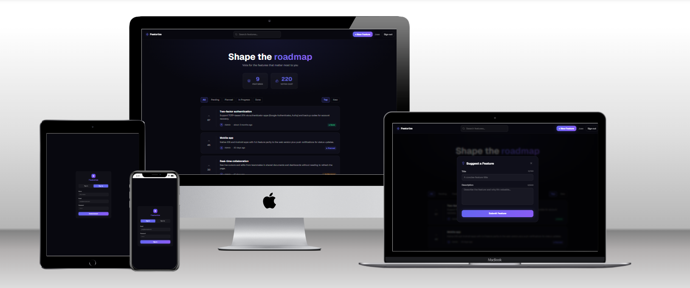

# Featurize — Feature Voting System



## Overview

A full-stack feature voting platform where users can submit,
discover, and prioritize product feature requests.
Built as a technical assessment demonstrating AI-assisted
development with Claude Code.

## Demo Credentials

- Admin: admin@featurize.com / Admin1234!
- User: user@featurize.com / User1234!

## Tech Stack

### Backend

| Technology            | Version | Why                                       |
| --------------------- | ------- | ----------------------------------------- |
| Django                | 5.0.4   | Batteries-included, clean OOP structure   |
| Django REST Framework | 3.15.1  | Best-in-class REST API for Django         |
| SimpleJWT             | 5.3.1   | Stateless auth, no session storage needed |
| boto3                 | 1.34    | Official AWS SDK for DynamoDB access      |
| bcrypt                | 4.1.3   | Industry standard password hashing        |

### Frontend

| Technology            | Version | Why                                              |
| --------------------- | ------- | ------------------------------------------------ |
| React + Vite          | 18 + 5  | Fast DX, instant HMR                             |
| TypeScript            | 5       | Type safety, better DX                           |
| TanStack Query        | 5       | Server state with caching and optimistic updates |
| Zustand               | 4       | Minimal UI state without Redux boilerplate       |
| React Hook Form + Zod | 7 + 3   | Performant forms with schema validation          |
| Framer Motion         | 11      | Production-grade animations                      |
| Tailwind CSS          | 3       | Utility-first, consistent design tokens          |

### Infrastructure

| Technology   | Why                                             |
| ------------ | ----------------------------------------------- |
| AWS DynamoDB | Serverless, scales to any load, pay-per-request |
| AWS IAM      | Least-privilege access for the app user         |

## Architecture Decisions

### Why Django + React instead of Next.js

Explicit separation of concerns. The backend is a pure REST API
and the frontend is a pure SPA. Each can be deployed, scaled,
and maintained independently. Next.js App Router adds complexity
(server components, edge runtime, adapter patterns) that caused
issues in practice.

### Why DynamoDB instead of PostgreSQL

Feature voting is a read-heavy workload with a simple,
predictable access pattern. DynamoDB's on-demand pricing means
zero cost at demo scale, and it scales infinitely without
provisioning. The trade-off is that complex queries require
careful GSI design upfront.

### Why TanStack Query instead of Redux

Redux is designed for complex client-side state. 90% of state
in this app is server state (features, votes, user). TanStack
Query handles caching, background refetch, and optimistic
updates out of the box, eliminating most of the boilerplate
Redux would require.

### Why Zustand instead of Context API

Context API re-renders all consumers on every state change.
Zustand uses selective subscriptions — components only
re-render when their specific slice changes.

### Why JWT instead of sessions

The API is stateless and could serve mobile clients in the
future. JWT tokens are self-contained and don't require
server-side session storage.

### Optimistic Updates Strategy

Vote mutations update the local TanStack Query cache immediately
before the API call resolves. If the API fails, the cache is
rolled back to the snapshot taken before the mutation. This
gives instant UI feedback with zero perceived latency.

## Features

### Core (Required)

- Submit feature requests with title and description
- View paginated list of feature requests
- Upvote and unvote features (toggle)
- Vote counts and ranking by popularity (Top / New)

### Extended

- JWT authentication with register and login
- Role-based access control (USER / ADMIN)
- Admin panel for managing feature statuses
- Feature status workflow: Pending → Planned → In Progress → Done
- Filter features by status
- Search features by title and description
- Optimistic UI updates on vote (instant feedback)
- Password strength indicator on register
- Skeleton loading states
- Responsive dark theme design

## Getting Started

### Prerequisites

- Python 3.11+
- Node.js 18+
- AWS account with DynamoDB tables created

### DynamoDB Setup

Create these tables in AWS Console (us-east-1, On-demand capacity):

- featurize-users: PK (String)
- featurize-features: PK (String), SK (String)
  GSI: status-createdAt-index (status/createdAt)
  GSI: voteCount-index (status/voteCount Number)
- featurize-votes: PK (String), SK (String)

### Backend Setup

```bash
cd backend
python -m venv venv
source venv/bin/activate
pip install -r requirements.txt
cp .env.example .env
# Fill in your AWS credentials in .env
python manage.py check
python seed.py
python seed_features.py
```

### Frontend Setup

```bash
cd frontend
npm install
cp .env.example .env
npm run dev
```

### Running Both

Terminal 1 (backend):

```bash
cd backend && source venv/bin/activate && python manage.py runserver
```

Terminal 2 (frontend):

```bash
cd frontend && npm run dev
```

Visit http://localhost:5173

## API Reference

### Auth

```
POST /api/auth/register — { name, email, password } → { user, access, refresh }
POST /api/auth/login    — { email, password }        → { user, access, refresh }
GET  /api/auth/me       — Bearer token               → { user }
```

### Features

```
GET   /api/features/          — ?status=&sort=top|new&page= → paginated list
POST  /api/features/          — Bearer { title, description } → feature
POST  /api/features/:id/vote  — Bearer → { voted, vote_count }
PATCH /api/features/:id/status — Bearer (admin) { status }  → feature
```

## Engineering Standards

This project follows SOLID principles, DRY, KISS, and YAGNI
throughout. All business logic lives in service classes
(UserService, FeatureService), not in views or components.
Validation happens on both frontend (Zod) and backend (DRF
serializers). Errors return a consistent shape with error code,
human message, and optional field reference.

AI collaboration was tracked throughout via prompts.txt with
ISO 8601 timestamps, demonstrating a structured approach to
AI-assisted development.

## Trade-offs & Future Improvements

- Real-time updates: WebSockets or SSE for live vote counts
- Email notifications: notify author when feature status changes
- Comments: discussion threads on feature requests
- Image attachments: screenshots for feature requests
- Full test coverage: unit tests for services, E2E with Playwright
- Rate limiting: per-IP limits on create and vote endpoints
- Deployment: containerize with Docker, deploy to AWS ECS
